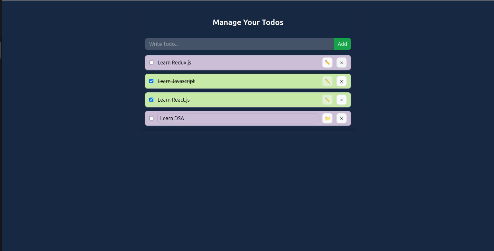

# React Todo List App with Context API and Local Storage

This repository contains a simple Todo List application built using React with Context API for state management and local storage for data persistence. It allows users to add, delete, and mark todos as completed.

## Getting Started

Follow these instructions to get a copy of the project up and running on your local machine for development and testing purposes.

### Prerequisites

Before you begin, ensure you have the following installed on your system:

- Node.js - Download and install [Node.js](https://nodejs.org/en/download/)
- npm or yarn - Node.js comes with npm installed, but you can also use yarn as an alternative package manager. 
### Installation

1. Clone the repository to your local machine:

```bash
git clone <https://github.com/saurabhjaykar1603/coxtext-api-localstorage-todos.git>
```

2. Navigate to the project directory:

```bash
cd <project_directory>
```

3. Install dependencies using npm or yarn:

```bash
npm install
```


### Running the Application

To run the development server, execute the following command:

```bash
npm run dev
```


Open your browser and visit [http://localhost:3000](http://localhost:3000) to view the application.

## Usage

Once the application is running, you can perform the following actions:

- **Add Todo**: Type in the input field and press enter to add new todos.
- **Delete Todo**: Click on the delete button next to each todo item to delete it.
- **Mark Todo as Completed**: Click on the checkbox next to each todo item to mark it as completed.
- **Data Persistence**: Todos are stored locally using browser's local storage, so they persist even after refreshing the page.


## Built With

- [React](https://reactjs.org/) - A JavaScript library for building user interfaces.
- [Vite](https://vitejs.dev/) - A next-generation frontend tooling system.